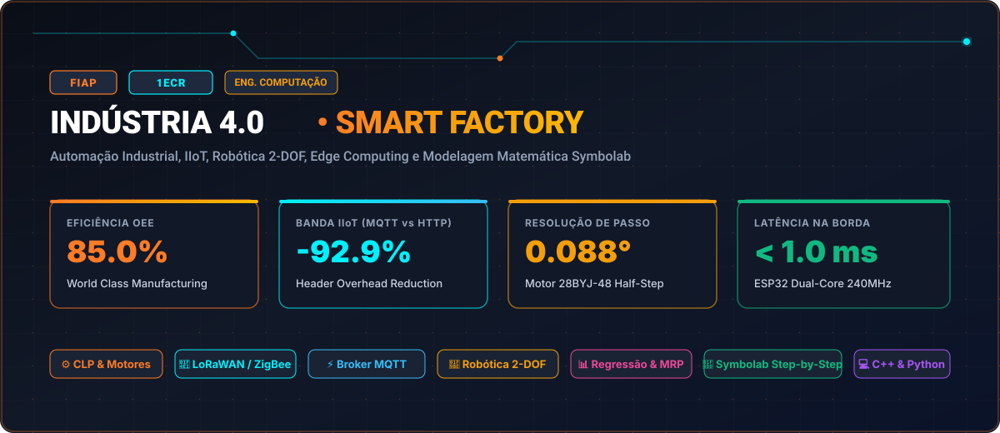

# FIAP • Indústria 4.0 (Turma 1ECR • 2022)



> **Engenharia da Computação — FIAP (Faculdade de Informática e Administração Paulista)**  
> **Turma:** 1ECR • Ano Letivo 2022  
> **Portal Interativo GitHub Pages:** [https://guimemee.github.io/fiap-industria-4-0/](https://guimemee.github.io/fiap-industria-4-0/)

---

## 📋 Sumário Executivo

Este repositório consolida o acervo acadêmico integral e os projetos práticos de engenharia da disciplina **Indústria 4.0**, contemplando:
1. **6 Checkpoints Oficiais (2022):** Enunciados integrais originais, memórias de cálculo passo a passo no padrão Symbolab e cadernos Jupyter (`.ipynb`) com gráficos executáveis.
2. **Provas e Avaliações Complementares (Parte 1):** Provas NAC 01, NAC 02, Provas Semestrais PS 01 e PS 02 (SIRE / MRP).
3. **Exercícios das Apostilas por Núcleo Temático:** Modelagem estatística e regressão linear, engenharia econômica Siemens (VPL/TIR), planejamento de necessidades materiais (MRP/Wilson), automação de atuadores em C++ e estudos de caso de mercado.
4. **Grandes Projetos Integradores:** Global Solution (GS 2º Semestre) e Challenge Sprints (Sprints 1 a 4).

---

## 🎯 6 Checkpoints Oficiais (Turma 1ECR • 2022)

### Checkpoint 1: Mapeamento Histórico, Revoluções Industriais e OEE
- **Questionário Oficial:** 5 questões dissertativas integrais cobrindo a 4ª revolução industrial planejada, inovações dos 4 períodos históricos, monopólio de mainframes IBM vs PCs no filme Piratas do Vale do Silício, camadas de IA vs Big Data vs Analytics e caso de tráfego em e-commerce.
- **Memória de Cálculo (Padrão Symbolab):**
  $$\text{OEE} = A \times P \times Q = \frac{432}{480} \times \frac{777}{864} \times \frac{739}{777} = 0{,}9000 \times 0{,}8993 \times 0{,}9511 = 76{,}98\%$$
- **Caderno Jupyter:** [`01_Checkpoints_2022/Checkpoint_1_Revolucoes_OEE/Resolucao_Calculos.ipynb`](01_Checkpoints_2022/Checkpoint_1_Revolucoes_OEE/Resolucao_Calculos.ipynb)

### Checkpoint 2: Inovação Tecnológica e Economia Digital (Hardware vs Software)
- **Tema:** Transição do modelo de hardware acoplado (Apple/IBM) para licenciamento escalável de sistemas operacionais (Microsoft MS-DOS/Windows) a partir das inovações do Xerox PARC.
- **Memória de Cálculo:** Break-even operacional ($u_{\text{be,hw}} = 3.846\text{ un}$ vs $u_{\text{be,sw}} = 137.931\text{ licenças}$) e alavancagem infinita de margem líquida com custo marginal unitário zero.
- **Caderno Jupyter:** [`01_Checkpoints_2022/Checkpoint_2_Hardware_Software/Resolucao_Calculos.ipynb`](01_Checkpoints_2022/Checkpoint_2_Hardware_Software/Resolucao_Calculos.ipynb)

### Checkpoint 3: Pilares da Indústria 4.0, Big Data e Redes IIoT
- **Questionário Oficial:** 10 questões originais abrangendo ESP32 vs ESP8266, acelerômetros para manutenção preditiva, UDP sem confirmação de entrega, topologia LoRaWAN com gateway intermediário, imunidade a ruído em rede mesh ZigBee e protocolos de alta largura de banda (Wi-Fi).
- **Memória de Cálculo:** Redução de tráfego de dados na borda da fábrica através de Edge Computing ($10{,}06\text{ GB/dia}$ para $17{,}17\text{ MB/dia}$, economia de $99{,}83\%$).
- **Caderno Jupyter:** [`01_Checkpoints_2022/Checkpoint_3_Pilares_BigData_IoT/Resolucao_Calculos.ipynb`](01_Checkpoints_2022/Checkpoint_3_Pilares_BigData_IoT/Resolucao_Calculos.ipynb)

### Checkpoint 4: Automação e Controle de Motores de Passo (Arduino)
- **Hardware:** Motor de passo 28BYJ-48 unipolar acionado via driver ULN2003 na modalidade Meio-Passo (Half-Step) com redução $1:64$.
- **Memória de Cálculo:** Resolução angular de $\Delta \theta = 0{,}08789^\circ/\text{passo}$ e frequência de comutação de $f = 1.024\text{ Hz}$ ($T_{\text{delay}} = 976\,\mu\text{s}$) para velocidade alvo de 15 RPM.
- **Código Fonte C++:** [`01_Checkpoints_2022/Checkpoint_4_Motores_Passo_Arduino/Industria 4.0 (1).ino`](01_Checkpoints_2022/Checkpoint_4_Motores_Passo_Arduino/Industria%204.0%20(1).ino)
- **Caderno Jupyter:** [`01_Checkpoints_2022/Checkpoint_4_Motores_Passo_Arduino/Resolucao_Calculos.ipynb`](01_Checkpoints_2022/Checkpoint_4_Motores_Passo_Arduino/Resolucao_Calculos.ipynb)

### Checkpoint 5: Robótica Industrial e Cinemática Direta Planar (2-DOF)
- **Cinemática Direta:** Braço articulado com elos $l_1 = 400\text{ mm}$ e $l_2 = 300\text{ mm}$. Para $\theta_1 = 30^\circ$ e $\theta_2 = 45^\circ$:
  $$x = 400 \cos(30^\circ) + 300 \cos(75^\circ) = 424{,}06\text{ mm}$$
  $$y = 400 \operatorname{sen}(30^\circ) + 300 \operatorname{sen}(75^\circ) = 489{,}78\text{ mm}$$
  $$\text{Alcance Radial } R = 647{,}85\text{ mm}$$
- **Caderno Jupyter:** [`01_Checkpoints_2022/Checkpoint_5_Robotica_Cinematica/Resolucao_Calculos.ipynb`](01_Checkpoints_2022/Checkpoint_5_Robotica_Cinematica/Resolucao_Calculos.ipynb)

### Checkpoint 6: Computação em Nuvem e Eficiência de Protocolos IIoT
- **Comparativo:** Transmissão de $1.000.000\text{ mensagens/dia}$ com payload de 32 bytes:
  - HTTP REST (Cabeçalho de 450B): $459{,}67\text{ MiB/dia}$ (Eficiência: $6{,}64\%$)
  - MQTT IoT (Cabeçalho de 2B): $32{,}42\text{ MiB/dia}$ (Eficiência: $94{,}12\%$)
  - **Economia Obtida:** $92{,}95\%$ de redução no enlace de dados.
- **Caderno Jupyter:** [`01_Checkpoints_2022/Checkpoint_6_IIoT_Nuvem_MQTT/Resolucao_Calculos.ipynb`](01_Checkpoints_2022/Checkpoint_6_IIoT_Nuvem_MQTT/Resolucao_Calculos.ipynb)

---

## 📝 Provas e Avaliações Complementares (Parte 1)

1. **Prova NAC 01:** Linhas de Montagem Inteligentes, Conversão de Processos para Minutos e Redução de Estoques (Droll Mecanics).
2. **Prova NAC 02:** Modelagem Financeira de Automação Industrial e Análise de Retorno com Metodologia Siemens.
3. **Prova Semestral PS 01:** Modelagem Estatística e Regressão Linear Simples/Múltipla para Custos Indiretos de Fabricação ($Y = aX + b$).
4. **Prova Semestral PS 02 & Sub:** Sistemas de Informação para Resultados Empresariais (SIRE) e Planejamento MRP.

---

## 📚 Exercícios Práticos das Apostilas por Tema

- **Tema 1: Modelagem Estatística e Regressão:** Caderno Jupyter [`03_Exercicios_Tematicos/Tema_1_Regressao_Estatistica/Analise_Estatistica_e_Modelagem_Industria40.ipynb`](03_Exercicios_Tematicos/Tema_1_Regressao_Estatistica/Analise_Estatistica_e_Modelagem_Industria40.ipynb) com ajuste de regressão linear para depreciação de veículos ($R^2 = 99{,}72\%$) e Lote Econômico.
- **Tema 2: Engenharia Econômica Industrial (Siemens):** Caderno Jupyter [`03_Exercicios_Tematicos/Tema_2_Engenharia_Economica/Modelagem_Financeira_Projetos_Siemens_VPL_TIR.ipynb`](03_Exercicios_Tematicos/Tema_2_Engenharia_Economica/Modelagem_Financeira_Projetos_Siemens_VPL_TIR.ipynb) deduzindo VPL ($+\text{R\$\ } 122.734{,}29$) e TIR ($22{,}76\%$).
- **Tema 3: MRP e Lote Econômico de Compra (Wilson):** Caderno Jupyter [`03_Exercicios_Tematicos/Tema_3_MRP_Planejamento_Materiais/Planejamento_Necessidades_Materiais_MRP_Explosao.ipynb`](03_Exercicios_Tematicos/Tema_3_MRP_Planejamento_Materiais/Planejamento_Necessidades_Materiais_MRP_Explosao.ipynb) calculando $Q^* = 1.386\text{ unidades}$ e ponto de reposição $ROP = 960\text{ unidades}$.
- **Tema 4: Automação e Redes Industriais IIoT:** Código C++ para microcontroladores, documentação CyberCup e metodologias de implantação FEL.
- **Tema 5: Estudos de Caso de Mercado e E-Commerce:** Análise de elasticidade de preços, dados da plataforma Webmotors e governança de startups.

---

## 🚀 Como Executar Localmente

### Pré-requisitos
- Python 3.10+ instalado
- Pacotes de computação científica:
  ```bash
  pip install numpy matplotlib pandas scipy
  ```

### Execução dos Cadernos Jupyter
```bash
jupyter notebook
```
Navegue até a pasta desejada e execute célula por célula com `Shift + Enter`.

---

## 🏛️ Créditos e Rastreabilidade
- **Instituição:** FIAP (Faculdade de Informática e Administração Paulista)
- **Curso:** Engenharia da Computação
- **Turma:** 1ECR • 2022
- **Autor / Aluno:** Guilherme Macario da Silva
